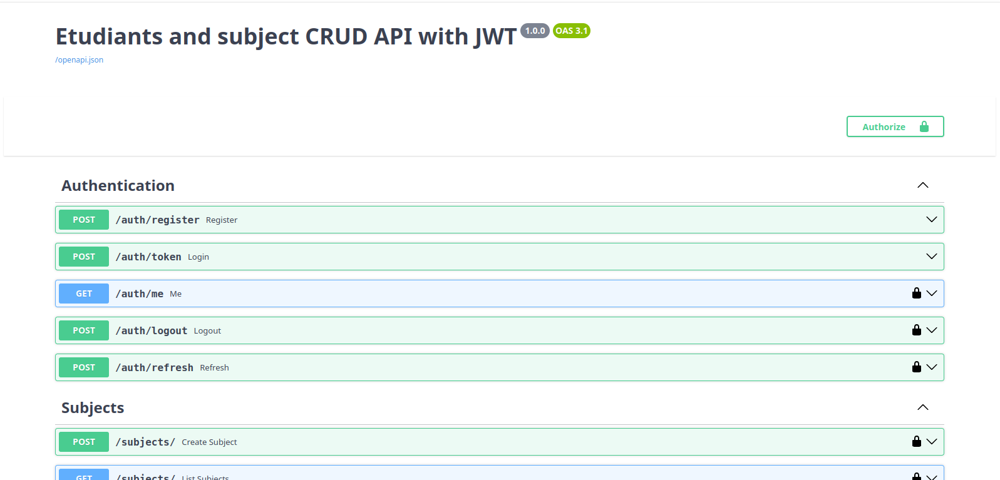
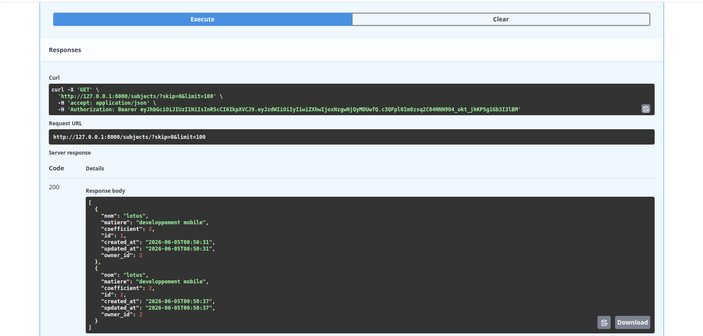

# Students and subjects CRUD API with JWT Authentication

Endpoints:

- **Auth** : `/auth/register`, `/auth/token`, `/auth/me`, `/auth/logout`, `/auth/refresh`
- **Students** :
  - `POST /students` 
  - `GET /students` 
  - `GET /students/my` 
  - `GET /students/{id}` 
  - `PUT /students/{id}` 
  - `DELETE /students/{id}` 
- **Subjects** :
  - `POST /subjects` 
  - `GET /subjects` 
  - `GET /subjects/my` 
  - `GET /subjects/{id}` 
  - `PUT /subjects/{id}` 
  - `DELETE /subjects/{id}` 

Lancer avec `uvicorn app.main:app --reload`

---

#  Technologies utilisées

- Python 3.x
- FastAPI
- SQLAlchemy
- Pydantic
- JWT Authentication
- Uvicorn
- MySQL

---

## Aperçu

